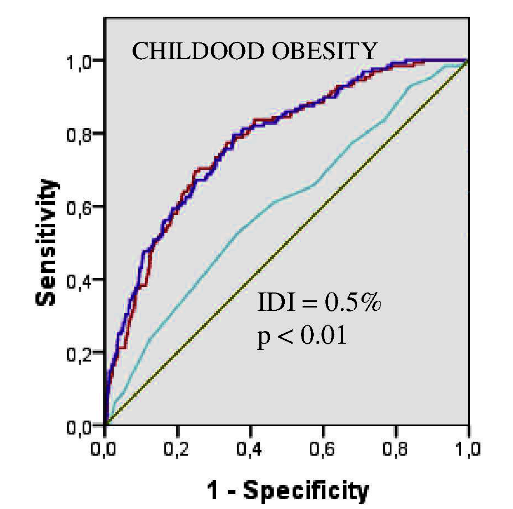

# Going from association to prediction
During unit 2 you found a number of genetic variants associated with disease or continuous traits.
In this session we will see if we can use these findings to predict whether an individual will go on to suffer from disease or their value of a continuous trait.
Here are the results for a GWAS of BMI:


| SNP	| CHR	| BP	| A1	| BETA	| P	| MAF | var_exp |
| ---	| ---	| ---	| ---	| ---	| ---	| ---	| ---	|
| rs12748679	| 1	| 72644585	| C	| -0.598	| 1.3E-10	| 0.205	| 0.0038 |
| rs630372	| 1	| 177885762	| A	| 0.687	| 5.5E-15	| 0.236	| 0.0055 |
| rs2867125	| 2	| 622827	| T	| -0.606	| 1.1E-09	| 0.168	| 0.0033 |
| rs13130484	| 4	| 45175691	| T	| 0.482	| 2.2E-10	| 0.434	| 0.0037 |
| rs2920930	| 8	| 76733973	| T	| -0.470	| 1.1E-08	| 0.296	| 0.0030 |
| rs8050136	| 16	| 53816275	| A	| 0.594	| 9.5E-15	| 0.395 | 0.0055 |
| rs12970134	| 18	| 57884750	| A	| 0.950	| 4.0E-29	| 0.267	| 0.0114 |


<br><br>
> **Task: Examine the strength of the evidence for the association (P-value), the magnitude of the association (beta/OR) and the variance in BMI explained for each of these SNPs, that you estimated in unit 2.  
How convinced are you that these variants are associated with BMI/being overweight?**

<br><br>
Some of these are very strong associations. p=4e-29 is extremely strong evidence of an association. Despite this the effect sizes and the variance explained are quite small, explaining at most 1% of variance (and 3.6% together). 

<br><br>
> **Question: These variants are all associated with being overweight, but what determines how good a variant is for prediction?**

<br><br>
Run the following lines of code in R, this runs an association between BMI and a new rare genetic varaible:

```
# load phenotype data into R
phen <- read.table("~/ibsc_unit2/data/phen_clean.txt")

# Generate a rare genetic variable
phen$rare <- ifelse(phen$BMI>49.8, 1, 0)

#Check for association between this new rare genetic variable and BMI
result <- glm(phen$BMI~phen$rare)

#Get the beta from the association
summary(result)$coef[2,1]

#Calculate the r2
var <- var(phen$BMI, na.rm=TRUE)
(summary(result)$coef[2,1]^2*var(phen$rare))/var
```

Compare the r^2, beta and MAF between the following two variables:

| SNP	| CHR	| BP	| A1	| BETA	| P	| MAF | var_exp |
| ---	| ---	| ---	| ---	| ---	| ---	| ---	| ---	|
| rs12970134	| 18	| 57884750	| A	| 0.950	| 4.0E-29	| 0.267	| 0.0114 |
| rare	| 18	| 57884751	| G	| 22.546	| 1.0E-19	| 0.0003	| 0.0100 |

<br><br>
> **Question: Which is the better predictor of BMI in the population?**
<br><br>
> **Question: If someone carries the risk allele for the first variant - how informative is this for this individual?**
<br><br>
> **Question: If someone carries the risk allele for the second variant - how informative is this for this individual?**


# Generating a genetic risk score

First we are going to generate a file that details the SNPs we want to use in the genetic risk score. Copy the following command and check that the snps_for_score.txt file is created.

```
echo 'rs571312        A       1
rs630372        A       1
rs8050136       A       1
rs12748679      T       1
rs13130484      T       1
rs2867125       C       1
rs2920930       G       1' >  ~/ibsc_unit2/data/snps_for_score.txt
```

Use this command to generate a risk score for each person in the sample:

```
plink --bfile ~/ibsc_unit2/data/geno_qc --score ~/ibsc_unit2/data/snps_for_score.txt --out ~/ibsc_unit2/data/BMI_score
```

Now we will load the data into R

```
score <- read.table(“~/ibsc_unit2/data/BMI_score.profile”, header=T)
phen <- read.table(“~/ibsc_unit2/data/phen_clean.txt”)
```
Run the following commands to investigate the distribution of the genetic risk score
```
BMI_score <- score$CNT2
hist(BMI_score)
hist(BMI_score[phen$BMIcat=="underweight" | phen$BMIcat=="healthy"], col=rgb(1,0,0,0.5), xlim=c(0,14), ylim=c(0,600), main = "BMI categories", xlab="genetic_score")
hist(BMI_score[phen$BMIcat=="obese"], col=rgb(0,0,1,0.5), add=T)
```

# Population-level predictions

What is the difference in obesity risk between those in the top 5% and bottom 5% of the score?
```
quantile(BMI_score, c(.05, .95))
sum(phen$BMIcat=="obese" & BMI_score<5)/sum(BMI_score<5)
sum(phen$BMIcat=="obese" & BMI_score>10)/sum(BMI_score>10)
```

There seems to be quite a significant difference in risk. Those in the bottom 5% of the risk score have only a 30% risk of being obese, whilst those in the top 5% of the risk score have a 60% risk of being obese.

<br><br>
> **Question: Do you think it would be an economically effective strategy to target an intervention only at children that were in the top 5% of the risk score?  
Although this is unlikely to happen for an outcome such as BMI, think about if the outcome were cancer or Alzheimer’s disease.  
Discuss this with a neighbour**

<br><br>
**As a genetic risk score increases there is a sliding scale of increased risk, but any health policies would likely have to define a threshold and this would have sensitivity and specificity implications.**

# Individual level prediction

There’s clearly a difference in the genetic_score distribution between healthy and underweight versus obese individuals. However, if you knew someone had a genetic score of 4, what would that tell you?

```
table (BMI_score, phen$BMIcat)
summary(phen$BMI[BMI_score==4])
boxplot(phen$BMI~BMI_score)
```

Of 335 people in this category: 7% are underweight, 27% are healthy, 35% are overweight, 32% are obese. So you might say that they are quite likely to be overweight or obese, but the range of BMIs for people in this category is very wide (11.5 to 43.3), so it would be difficult to predict their BMI with any accuracy.


Compare the mean BMIs of people at the top and bottom of the central 90%
```
quantile(BMI_score, c(.05, .95))
summary(phen$BMI[BMI_score==5])
summary(phen$BMI[BMI_score==10])
```

90% of people fall between BMI_scores of 5 and 10, the mean BMI difference between the top and bottom of this range is: 2.81kg/m2 BMI=30 versus BMI=27. 

<br><br>
> **For the majority of people knowing your BMI score is very useful / somewhat useful / pretty useless (delete as applicable)**

If we classed everyone with BMI_score >10 as at risk of obesity. How often would we be right and wrong?

```
obese <- phen$BMIcat
levels(obese) <- c("control", "obese", "control", "control")
risk <- factor(BMI_score)
levels(risk) <- c("<=10", "<=10", "<=10", "<=10", "<=10", "<=10", "<=10", "<=10", "<=10", ">10", ">10", ">10")
table(obese, risk)
```
<br><br>
> **Give the numbers in each category:  
given low risk prediction & did not become obese:  
given low risk prediction & did become obese:  
given high risk prediction & did become obese:  
given high risk prediction & did not become obese: 
<br><br> 
Question: what proportion of the time would you be right?**

<br><br>
You are only going to be right 57% of the time. So for an individual you can make a prediction, but it’s not much better than flipping a coin

What about if you took BMI_score>=13 as the cut-off?

```
risk <- factor(BMI_score)
levels(risk) <- c("<=10", "<=10", "<=10", "<=10", "<=10", "<=10", "<=10", "<=10", "<=10", "<=10", "<=10", ">10")
table(obese, risk)
```
<br><br>
> **Give the numbers in each category:  
given low risk prediction & did not become obese:  
given low risk prediction & did become obese:  
given high risk prediction & did become obese:  
given high risk prediction & did not become obese:**

<br><br>
In this dataset for the 2 people you predicted would be obese, you would be right, but you would have incorrectly told 3524 people that they were not in the high risk group.

<br><br>
> **Question: What proportion of people have a genetic risk score>=13?  
Can we consider this a similar situation as the rare high penetrant mutations you have considered in other parts of this unit?**

# Published examples
Some studies have attempted to predict BMI from genotype (e.g. Speliotes 2010, Nature Genetics 42(11):937-948)


Fig a. Mean BMI according to risk score - Note there is an increase of ~3kg/m2 between the top and bottom of the genetic risk score
Fig b. Displays the ROC curve for 2 prediction models. Solid line includes age, age2 and sex (AUC=0.515), dashed line includes age, age2, sex and 32 BMI SNPs (AUC=0.575).

<br><br>
> **Question: Does including the SNPs improve the prediction of obesity?**

<br><br>
Another study Morandi PloS ONE 2012, 7(11):e49919 compared genetic prediction to prediction using traditional risk factors.




Turquoise= genetic risk score, Red= traditional risk factors, dark blue= combined traditional risk factprs and genetic risk score.
Integrated discrimination improvement (IDI) = 0.5%, shows the possible accuracy improvement associated with adding the genetic score to the traditional risk factors alone. 

<br><br>
> **Question: Is there any improvement including SNPs in the prediction?**

<br><br>

Look up this study now and see which traditional risk factors were included in the model.

<br><br>
> **Why does a prediction that includes ‘parental BMI’ do just as well as one that includes SNPs?**

<br><br>
